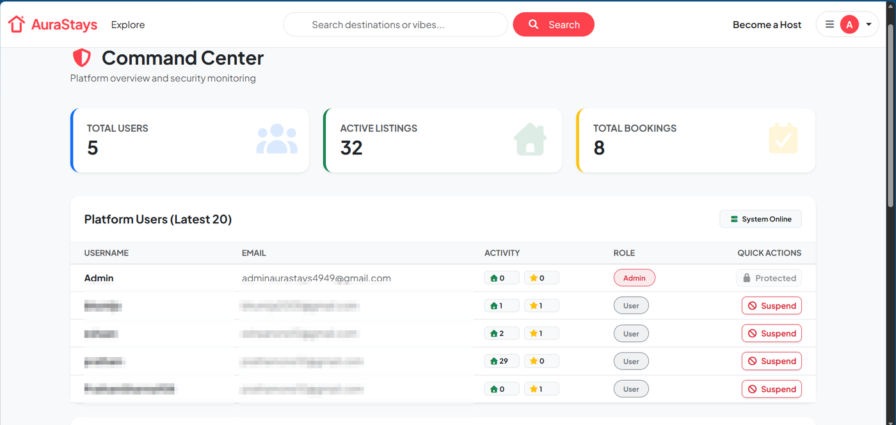
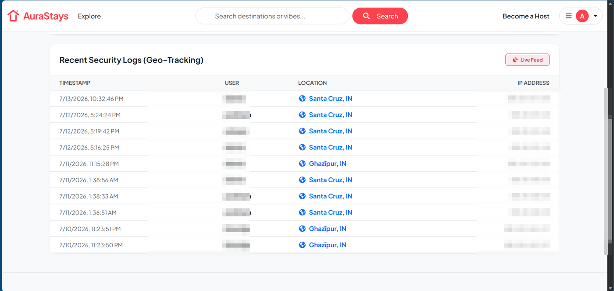
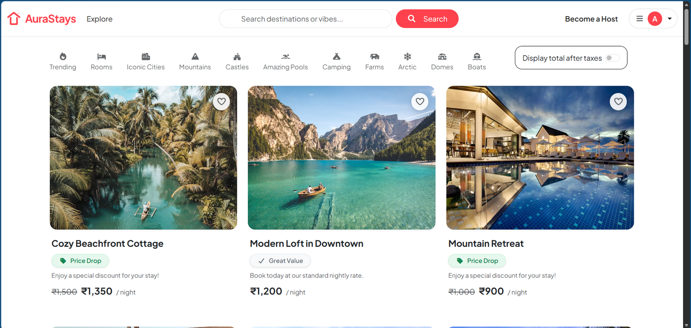
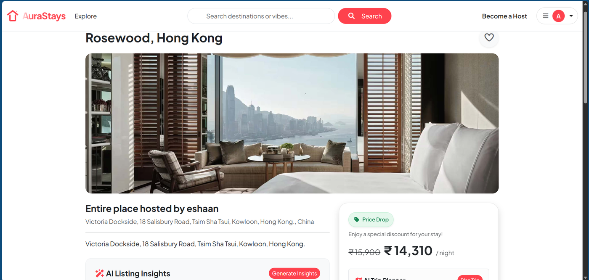

# 🏡 AuraStays


> A full-stack accommodation booking platform inspired by Airbnb — built with Node.js, Express, and MongoDB. AuraStays goes beyond a typical CRUD clone by implementing an **enterprise-grade geographic security engine**, a **5-layer OWASP-aligned defense architecture**, an **automated CI/CD pipeline**, AI-powered trip insights, interactive mapping, and a real-time booking system.

**[🌍 View Live Application](https://aurastays-nwll.onrender.com)** &nbsp;|&nbsp; **[💻 Source Code](https://github.com/Prathamlm30/AuraStays)**

---

## 🎯 Why This Project Stands Out

Most student booking-app clones stop at CRUD + auth. AuraStays adds a security, testing, and deployment layer modeled on techniques used by real fintech and enterprise platforms:

- **Impossible Travel Detection** — flags account compromise by calculating whether two logins from the same account are geographically plausible within the elapsed time.
- **Risk-Based Step-Up Authentication** — sensitive actions (payout changes, listing deletion) require an OTP challenge instead of blanket 2FA on every login, balancing security with UX.
- **5-Layer OWASP Security Architecture** — a defense-in-depth stack covering HTTP headers, NoSQL injection, XSS, brute-force, and API-abuse vectors (full breakdown below).
- **Enterprise-Grade Testing Infrastructure** — 17 Jest/Supertest integration tests plus a full Playwright E2E suite, both at a 100% pass rate.
- **Automated CI/CD Pipeline** — every push triggers a GitHub Actions workflow that provisions a clean environment and runs the entire E2E suite before code is trusted.
- **Admin Command Center** — a live operations dashboard giving platform admins visibility into users, listings, bookings, and raw geo-security logs in real time.

Together, this mirrors how production systems (banking apps, SaaS platforms) approach account-takeover prevention, defense-in-depth hardening, and release safety — making AuraStays a strong talking point for security-, backend-, and DevOps-focused interviews.

---

## ✨ Key Features

### 🛡️ Enterprise-Grade Security & Fraud Prevention
- **"Impossible Travel" Threat Engine** — uses the Haversine formula on IP geolocation data to compute travel velocity between consecutive logins and automatically intercepts sessions that exceed physically possible speeds (e.g. >900 km/h jumps).
- **Dynamic MFA (Multi-Factor Auth)** — generates cryptographically random 6-digit OTPs and dispatches them via NodeMailer + Brevo SMTP for identity verification during high-risk sessions.
- **Geographic Session Tracking** — parses proxy headers (`x-forwarded-for`) to resolve true client IPs behind cloud load balancers, then maps them to coordinates via `geoip-lite` and persists them to MongoDB for auditing.
- **Action-Specific Soft Blocks** — gates sensitive operations (editing bank payout details, deleting listings) behind OTP re-verification rather than blocking the entire session.
- **Admin Command Center** — a dedicated `/admin` dashboard showing total users, active listings, total bookings, a live user-management table (suspend/promote), and a real-time feed of security/geo-tracking logs.

### 🧱 5-Layer OWASP Security Architecture
A defense-in-depth pipeline where every request is filtered through five independent hardening layers before it reaches business logic:

| Layer | Name | Defense | Implementation |
|:---:|---|---|---|
| **1** | HTTP Shield | Secures response headers & hides the underlying tech stack | `Helmet.js` |
| **2** | Database Guardian | Strips MongoDB operator keys to block NoSQL injection | `express-mongo-sanitize` |
| **3** | Input Cleanser | Strips malicious `<script>` payloads to prevent XSS, backed by schema validation | `sanitize-html` + `Joi` |
| **4** | Authentication Blocker | Throttles login attempts by IP to stop brute-force credential attacks | Custom IP-based rate limiting |
| **5** | API Wallet Protector | Throttles calls to Gemini AI routes to prevent quota exhaustion & API abuse | Route-specific rate limiting |

### 🧪 Enterprise-Grade Testing Infrastructure
- **Backend / API Testing** — a Jest & Supertest integration suite (**17 tests**) using `mongodb-memory-server` for fully isolated, leak-free database testing; external services (Brevo, Mapbox, Cloudinary) are mocked so tests run deterministically offline.
- **Frontend / E2E Testing** — Playwright drives full-stack browser automation across critical user journeys, including the AI Trip Planner flow and the Impossible Travel OTP challenge.
- **100% pass rate** maintained across both the API and UI test suites.

### ⚙️ CI/CD Pipeline
- A GitHub Actions workflow triggers on every push: it provisions a clean Node.js environment, securely injects encrypted repository secrets (`ENV_FILE`), boots the application server, and runs the full Playwright E2E suite — catching regressions before they ever reach deployment.

### 🔐 Authentication & Authorization
- **OAuth 2.0** — Google sign-in via Passport.js.
- **Local Auth** — email/password with salted hashing and secure session management.
- **Role-Based Access Control (RBAC)** — middleware-enforced permissions so only property owners can edit/delete their own listings, with a separate Admin role for platform moderation.

### 📅 Advanced Booking Engine
- **Interactive Calendar** — Flatpickr-powered date selection.
- **Real-Time Availability** — MongoDB queries block dates already reserved to prevent double-booking.
- **Trips Dashboard** — view upcoming trips, calculated total costs, and cancel reservations with automatic DB sync.

### 🤖 AI-Powered Experience
- **AI Listing Insights** — summarizes property details, location vibe, and aggregated guest reviews.
- **AI Trip Planner** — generates custom itineraries based on a listing's location.
- **Host Smart-Reply** — AI-assisted draft responses for hosts replying to guest reviews.

### 🗺️ Interactive Maps & Media
- **Geocoding** — converts addresses to coordinates via the Mapbox API.
- **Dynamic Mapping** — interactive, zoomable maps on each listing's page.
- **Cloud Storage** — image uploads routed directly to Cloudinary.

---

## 🛠️ Tech Stack

**Frontend**
- HTML5, CSS3, JavaScript (ES6+)
- EJS (Embedded JavaScript Templating)
- Bootstrap 5
- Flatpickr

**Backend**
- Node.js & Express.js
- MongoDB & Mongoose (ODM)
- Passport.js (Local + Google OAuth 2.0)
- Joi (server-side schema validation)
- GeoIP-Lite & Node's native Crypto module (security engine)

**Security & Hardening**
- Helmet.js (secure HTTP headers)
- express-mongo-sanitize (NoSQL injection prevention)
- sanitize-html (XSS prevention)
- Custom IP-based rate limiting (auth & AI routes)

**Testing & Quality**
- Jest & Supertest (backend/API integration testing)
- mongodb-memory-server (isolated, in-memory test database)
- Playwright (frontend E2E & browser automation)

**DevOps & CI/CD**
- GitHub Actions (automated build, secret injection, and E2E test pipeline)

**Cloud, Delivery & APIs**
- Mapbox API (geocoding & maps)
- Cloudinary (image hosting)
- Brevo SMTP + NodeMailer (transactional email / OTP delivery)
- AI SDK (Gemini/OpenAI for insights & itineraries)

---

## 📂 Project Structure

```text
AuraStays/
├── .github/
│   └── workflows/    # GitHub Actions CI/CD pipeline definitions
├── controllers/      # Route logic (listings, users, bookings, reviews, admin)
├── models/           # Mongoose schemas (Listing, User, Review, Booking, SecurityLog)
├── routes/           # Express router definitions
├── tests/            # Jest/Supertest API tests + Playwright E2E specs
├── utils/            # Helper engines (geoMath.js, sendEmail.js)
├── views/            # EJS templates (layouts, listings, users, auth, admin)
├── public/           # Static assets (CSS, client-side JS, images)
├── middleware.js     # Custom authentication, security, and validation middleware
├── cloudConfig.js    # Cloudinary setup
└── app.js            # Main application entry point
```

---

## 📸 Screenshots

<table>
  <tr>
    <td width="50%">
      <b>Admin Command Center</b><br/>
      
    </td>
    <td width="50%">
      <b>Security &amp; Geo-Tracking Logs</b><br/>
      
    </td>
  </tr>
  <tr>
    <td width="50%">
      <b>Browse Listings</b><br/>
      
    </td>
    <td width="50%">
      <b>Listing Detail — AI Insights &amp; Booking</b><br/>
      
    </td>
  </tr>
</table>

*User names, emails, and IP addresses in the dashboard screenshots above are pixelated to protect real user data before publishing.*

---

## 🚀 Run Locally

Want to test AuraStays on your local machine? Follow these steps:

### 1. Clone the repository

```bash
git clone https://github.com/Prathamlm30/AuraStays.git
cd AuraStays
```

### 2. Install dependencies

```bash
npm install
```

### 3. Setup Environment Variables

Create a `.env` file in the root directory and add the following keys:

```
# Cloudinary Configuration
CLOUD_NAME=your_cloudinary_name
CLOUD_API_KEY=your_cloudinary_api_key
CLOUD_API_SECRET=your_cloudinary_api_secret

# Mapbox Configuration
MAP_TOKEN=your_mapbox_public_token

# MongoDB Atlas
ATLASDB_URL=your_mongodb_connection_string

# Express Session Secret
SECRET=your_super_secret_session_key

# Google OAuth 2.0 (If applicable)
GOOGLE_CLIENT_ID=your_google_client_id
GOOGLE_CLIENT_SECRET=your_google_client_secret

# Brevo SMTP Engine (For Security/OTP Emails)
SMTP_HOST=smtp-relay.brevo.com
SMTP_PORT=587
SMTP_USER=your_brevo_registered_email
SMTP_PASS=your_brevo_smtp_password
```

### 4. Start the Application

```bash
node app.js
```

The application will be running at `http://localhost:8080`.

### 5. Run the Test Suites (Optional)

```bash
# Run the Jest/Supertest API test suite
npm test

# Run the Playwright E2E suite
npx playwright test
```

---

## 🧑‍💻 About the Developer

**Pratham Sharma**

Engineering Student at National Institute of Technology (NIT), Kurukshetra (IIOT)

I'm an engineering student with a growing focus on the intersection of **artificial intelligence and cybersecurity** in full-stack web development. My project portfolio reflects that focus: alongside AuraStays, I've built **CyberShield AI**, a full-stack security application, and I completed the **Amazon ML Summer School 2025**, deepening my grounding in applied machine learning.

AuraStays is the culmination of that interest — I built it to go far beyond standard full-stack MVC architecture and RESTful API design, layering in a custom geographic security engine (Impossible Travel detection, risk-based MFA, and an admin monitoring dashboard), a 5-layer OWASP-aligned defense architecture, an enterprise-grade Jest/Playwright testing suite, and a fully automated CI/CD pipeline via GitHub Actions. Combined with third-party integrations (Mapbox, Cloudinary) and AI-powered features, it's a comprehensive showcase of modern web development practiced with the rigor of applied security engineering and machine learning.

- [Connect with me on LinkedIn](https://www.linkedin.com/in/pratham-sharma-0b3140280)
- [Check out my GitHub Portfolio](https://github.com/Prathamlm30)

*If you like this project, feel free to leave a ⭐ on the repository!*
